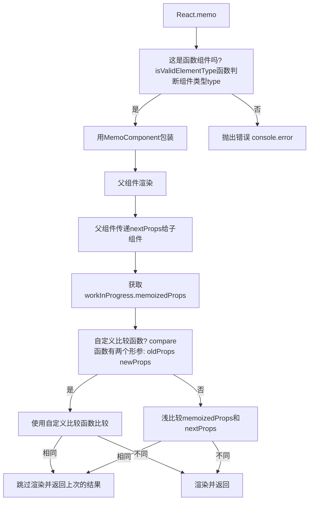

# React.memo 解决了什么问题?

`React.memo` 是 React 16.6 版本引入的一个新功能，它是一个高阶组件，旨在优化函数组件的性能。那么，它到底解决了什么问题呢？

## React.memo 基础用法

### 问题：不必要的渲染

在 React 中，组件的重新渲染通常是由于状态或 props 的变化引起的。但有时，即使相关数据没有发生变化，组件也可能会进行不必要的渲染。这种不必要的渲染可能会导致性能下降，尤其是在复杂的应用程序中。

::: details demo 代码
<<< @/components/react/hooks/memo/BasicComponent.jsx
:::

在这个例子中，`ParentComponent`有一个状态`count`，每当我们点击按钮时，这个状态就会增加。由于 React 的工作方式，每次`count`发生变化时，`ParentComponent`都会重新渲染。这也意味着`ChildComponent`也会重新渲染，尽管传递给它的`text` prop 并没有发生任何变化。

这就是一个不必要的渲染的例子。每次`ParentComponent`的状态发生变化时，`ChildComponent`都会进行不必要的渲染，即使它接收的 props 完全相同。

这种情况在大型应用程序中可能会变得更加严重，因为不必要的渲染可能会在多个组件之间产生连锁反应，导致整个应用程序的性能下降。

### 解决方案：浅比较 props

`React.memo` 的工作原理是对组件的 props 进行浅比较。如果传递给组件的 props 没有发生变化，`React.memo` 会复用上一次的渲染结果，从而避免不必要的渲染。

::: details demo 代码
<<< @/components/react/hooks/memo/MemoizedComponent.jsx
:::

在上述例子中，即使 `ParentComponent` 重新渲染（例如，由于 `count` 状态的变化），由于传递给 `MemoizedChildComponent` 的 `text` prop 没有发生变化，`ChildComponent` 不会重新渲染。如果我们没有使用 `React.memo`，每次点击按钮时，`ChildComponent` 都会重新渲染，即使其 props 没有发生变化。

## 调用 React.memo 后大致执行情况

