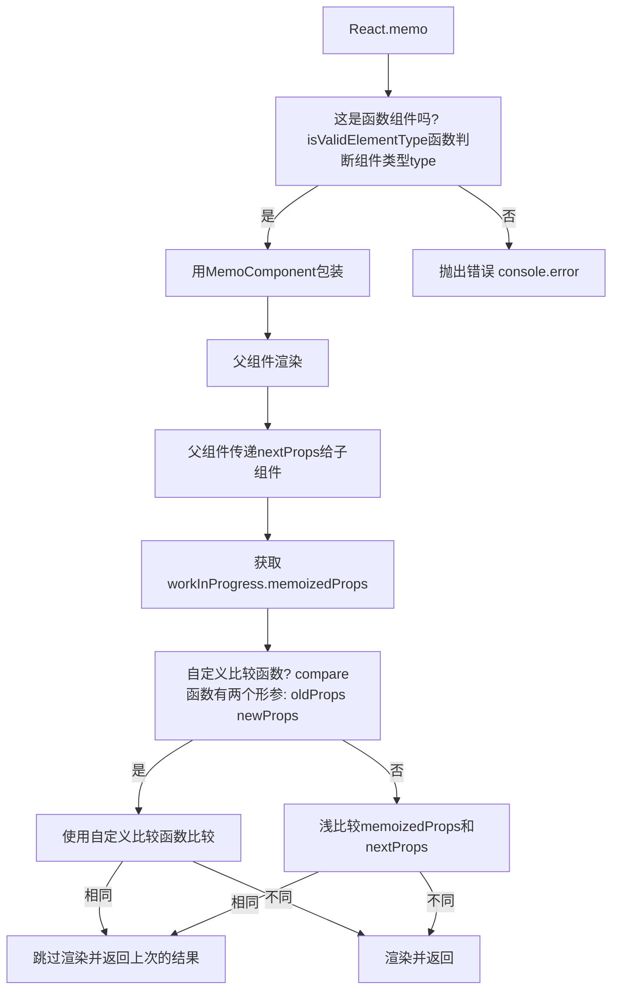

# React.memo 解决了什么问题?

`React.memo` 是 React 16.6 版本引入的一个新功能，它是一个高阶组件，旨在优化函数组件的性能。那么，它到底解决了什么问题呢？

## React.memo 基础用法

### 问题：不必要的渲染

在 React 中，组件的重新渲染通常是由于状态或 props 的变化引起的。但有时，即使相关数据没有发生变化，组件也可能会进行不必要的渲染。这种不必要的渲染可能会导致性能下降，尤其是在复杂的应用程序中。

<div ref="memo1" />

::: details demo 代码
<<< @/components/react/hooks/memo/BasicComponent.jsx
:::

在这个例子中，`ParentComponent`有一个状态`count`，每当我们点击按钮时，这个状态就会增加。由于 React 的工作方式，每次`count`发生变化时，`ParentComponent`都会重新渲染。这也意味着`ChildComponent`也会重新渲染，尽管传递给它的`text` prop 并没有发生任何变化。

这就是一个不必要的渲染的例子。每次`ParentComponent`的状态发生变化时，`ChildComponent`都会进行不必要的渲染，即使它接收的 props 完全相同。

这种情况在大型应用程序中可能会变得更加严重，因为不必要的渲染可能会在多个组件之间产生连锁反应，导致整个应用程序的性能下降。

### 解决方案：浅比较 props

`React.memo` 的工作原理是对组件的 props 进行浅比较。如果传递给组件的 props 没有发生变化，`React.memo` 会复用上一次的渲染结果，从而避免不必要的渲染。

<div ref="memo2" />

::: details demo 代码
<<< @/components/react/hooks/memo/MemoizedComponent.jsx
:::

在上述例子中，即使 `ParentComponent` 重新渲染（例如，由于 `count` 状态的变化），由于传递给 `MemoizedChildComponent` 的 `text` prop 没有发生变化，`ChildComponent` 不会重新渲染。如果我们没有使用 `React.memo`，每次点击按钮时，`ChildComponent` 都会重新渲染，即使其 props 没有发生变化。

## 自定义比较函数

`React.memo` 的第二个参数是一个比较函数，它允许我们自定义比较 props 的逻辑。如果我们传递了一个比较函数，`React.memo` 将使用它来决定是否重新渲染组件，而不是简单地使用浅比较。

举例说明：

假设我们有一个 User 组件，它接受一个 user 对象和一个 onUpdate 函数作为 props。我们只关心 user 对象中的 id 和 name 字段，而不关心其他字段。此外，我们知道 onUpdate 函数的引用可能会经常改变，但它的实际功能不会改变。

在这种情况下，我们可以使用 React.memo 的第二个参数来提供一个自定义的比较函数：

```jsx
const areEqual = (prevProps, nextProps) => {
  // 检查user对象中的id和name字段是否相同
  return (
    prevProps.user.id === nextProps.user.id &&
    prevProps.user.name === nextProps.user.name
  );
};

const User = React.memo(({ user, onUpdate }) => {
  // 组件逻辑
}, areEqual);
```

在上述例子中，即使 onUpdate 函数的引用或 user 对象中的其他字段发生变化，只要 id 和 name 字段保持不变，User 组件就不会重新渲染。

总之，React.memo 的第二个参数提供了强大的自定义比较逻辑，使我们能够更精确地控制组件的重新渲染行为。

## 注意事项

### 传递函数给子组件

当父组件重新渲染时，如果它向子组件传递一个函数，并且这个函数是在父组件的 render 方法或函数组件的主体中定义的，那么每次父组件重新渲染时，这个函数都会被重新创建。这意味着从技术上讲，这个函数在每次渲染时都是创建一个新的函数，即使它的实际功能没有变化。

React.memo 通过浅比较 props 来避免不必要的重新渲染。但是，由于每次都是一个新的函数实例，浅比较会认为函数已经改变，从而导致子组件重新渲染。

<div ref="memo3" />

::: details demo 代码
<<< @/components/react/hooks/memo/FunctionInProps.jsx
:::

在上述案例中，我们观察到以下情况：

当点击 Increment 按钮时，父组件的状态 count 发生变化，导致父组件重新渲染。由于父组件重新渲染，getText 函数也会被重新创建。

由于使用了 memo 对 ChildComponent 进行了包裹，MemoizedChildComponent 会进行浅比较以决定是否重新渲染。由于 getText 函数在每次渲染时都是一个新的实例，浅比较会认为该函数发生了变化，因此会触发子组件的重新渲染。

### 解决方案

常见的三种解决方案如下:

#### 1、将函数移至组件外部

如果函数不依赖于组件的 props 或 state，您可以将其移至组件外部，这样它就不会在每次渲染时重新创建。

<div ref="memo4" />

::: details demo 代码
<<< @/components/react/hooks/memo/FunctionInProps2.jsx
:::

#### 2、使用类组件的方法

如果您使用的是类组件，可以将函数作为类的方法，这样它的引用在重新渲染之间就会保持不变。

<div ref="memo5" />

::: details demo 代码
<<< @/components/react/hooks/memo/FunctionInProps3.jsx
:::

#### 3、使用 useCallback

如果您使用的是函数组件，可以使用 useCallback Hook 来确保函数的引用在重新渲染之间保持不变。

<div ref="memo6" />

::: details demo 代码
<<< @/components/react/hooks/memo/FunctionInProps4.jsx
:::

在上面的案例中，只有当依赖列表中的值发生变化时，getText 函数才会被重新创建。

### 传递对象/数组给子组件

当父组件重新渲染时，如果它向子组件传递一个对象，并且这个对象是在父组件的 render 方法或函数组件的主体中定义的，那么每次父组件重新渲染时，这个对象都会被重新创建。这意味着从技术上讲，这个对象在每次渲染时都是创建一个新的对象，即使它的实际功能没有变化。

React.memo 通过浅比较 props 来避免不必要的重新渲染。但是，由于每次都是一个新的对象，浅比较会认为对象已经改变，从而导致子组件重新渲染。

<div ref="memo7" />

::: details demo 代码
<<< @/components/react/hooks/memo/ObjectInProps.jsx
:::

### 解决方案

常见的三种解决方案如下:

#### 1、将对象移至组件外部

如果对象不依赖于组件的 props 或 state，您可以将其移至组件外部，这样它就不会在每次渲染时重新创建。

<div ref="memo8" />

::: details demo 代码
<<< @/components/react/hooks/memo/ObjectInProps1.jsx
:::

#### 2、使用 useState 或 useRef 来存储对象

如果您的对象不经常变化，可以使用 useState 或 useRef 来存储它，这样它的引用在重新渲染之间就会保持不变。

<div ref="memo9" />

::: details demo 代码
<<< @/components/react/hooks/memo/ObjectInProps2.jsx
:::

#### 3、使用 useMemo

useMemo 可以帮助您避免在每次渲染时都重新计算昂贵的操作，并记住最近一次的结果。

<div ref="memo10" />

::: details demo 代码
<<< @/components/react/hooks/memo/ObjectInProps3.jsx
:::

在上面的代码中，userInfo 只会在组件首次渲染时创建，除非依赖列表中的值发生变化。

## 调用 React.memo 后大致执行情况



<script setup>
import { ref } from 'vue'
import renderReact from '@components/react/renderReact'
import BasicComponent from '@components/react/hooks/memo/BasicComponent'
import MemoizedComponent from '@components/react/hooks/memo/MemoizedComponent'
import FunctionInProps from '@components/react/hooks/memo/FunctionInProps'
import FunctionInProps2 from '@components/react/hooks/memo/FunctionInProps2'
import FunctionInProps3 from '@components/react/hooks/memo/FunctionInProps3'
import FunctionInProps4 from '@components/react/hooks/memo/FunctionInProps4'
import ObjectInProps from '@components/react/hooks/memo/ObjectInProps'
import ObjectInProps1 from '@components/react/hooks/memo/ObjectInProps1'
import ObjectInProps2 from '@components/react/hooks/memo/ObjectInProps2'
import ObjectInProps3 from '@components/react/hooks/memo/ObjectInProps3'
const memo1 = ref(null)
const memo2 = ref(null)
const memo3 = ref(null)
const memo4 = ref(null)
const memo5 = ref(null)
const memo6 = ref(null)
const memo7 = ref(null)
const memo8 = ref(null)
const memo9 = ref(null)
const memo10 = ref(null)
renderReact(BasicComponent, memo1)
renderReact(MemoizedComponent, memo2)
renderReact(FunctionInProps, memo3)
renderReact(FunctionInProps2, memo4)
renderReact(FunctionInProps3, memo5)
renderReact(FunctionInProps4, memo6)
renderReact(ObjectInProps, memo7)
renderReact(ObjectInProps1, memo8)
renderReact(ObjectInProps2, memo9)
renderReact(ObjectInProps3, memo10)
</script>
