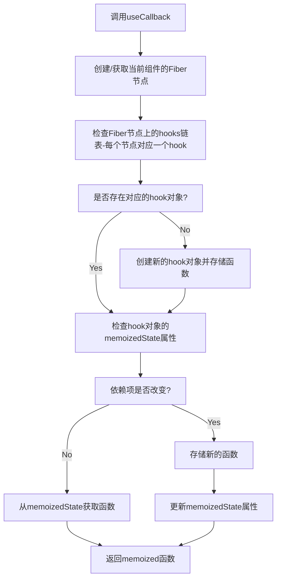

# React Hooks 系列 之 useCallback

## 调用 useCallback 后大致执行情况

```mermaid
graph TD
    A1[调用useCallback]
    B1[创建/获取当前组件的Fiber节点]
    C1[检查Fiber节点上的hooks链表-每个节点对应一个hook]
    D1[是否存在对应的hook对象?]
    E1[创建新的hook对象并存储函数]
    F1[检查hook对象的memoizedState属性]
    G1[依赖项是否改变?]
    H1[从memoizedState获取函数]
    I1[存储新的函数]
    J1[更新memoizedState属性]
    K1[返回memoized函数]

    A1 --> B1
    B1 --> C1
    C1 --> D1
    D1 -- No --> E1
    D1 -- Yes --> F1
    E1 --> F1
    F1 --> G1
    G1 -- No --> H1 --> K1
    G1 -- Yes --> I1 --> J1 --> K1
```
