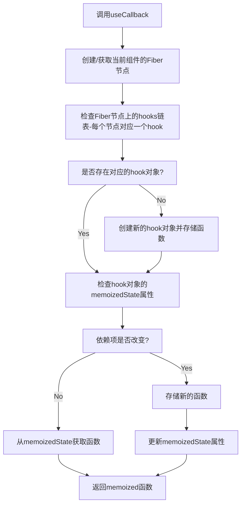

# React Hooks 系列 之 useCallback

## 介绍

useCallback 是 React Hooks 中的一个重要成员，它允许我们在多次渲染中缓存函数。简单来说，它可以帮助我们避免因为函数的重新创建而导致的不必要的重新渲染。

```js
const cachedFn = useCallback(fn, dependencies);
```

## 用法

### 1、跳过组件的重新渲染

当你优化渲染性能的时候，有时需要缓存传递给子组件的函数。例如，当你传递一个函数给一个被 memo 包裹的子组件时，useCallback 可以确保函数在多次渲染中保持不变，除非它的依赖发生改变。

<div ref="useCallback1" />

::: details demo 代码
<<< @/components/react/hooks/memo/FunctionInProps4.jsx
:::

在上面的案例中，只有当依赖列表中的值发生变化时，getText 函数才会被重新创建。

### 2、优化自定义 Hook

当你创建自定义Hook时，建议将返回的任何函数都包裹在useCallback中。这确保了Hook的使用者在需要时能够优化自己的代码。

<div ref="useCallback2" />

::: details demo 代码
<<< @/components/react/hooks/useCallback/useCounter.jsx
:::

## 调用 useCallback 后大致执行情况



<script setup>
import { ref } from 'vue'
import renderReact from '@components/react/renderReact'
import FunctionInProps4 from '@components/react/hooks/memo/FunctionInProps4'
import useCounter from '@components/react/hooks/useCallback/useCounter'

const useCallback1 = ref(null)
const useCallback2 = ref(null)
renderReact(FunctionInProps4, useCallback1)
renderReact(useCounter, useCallback2)
</script>
