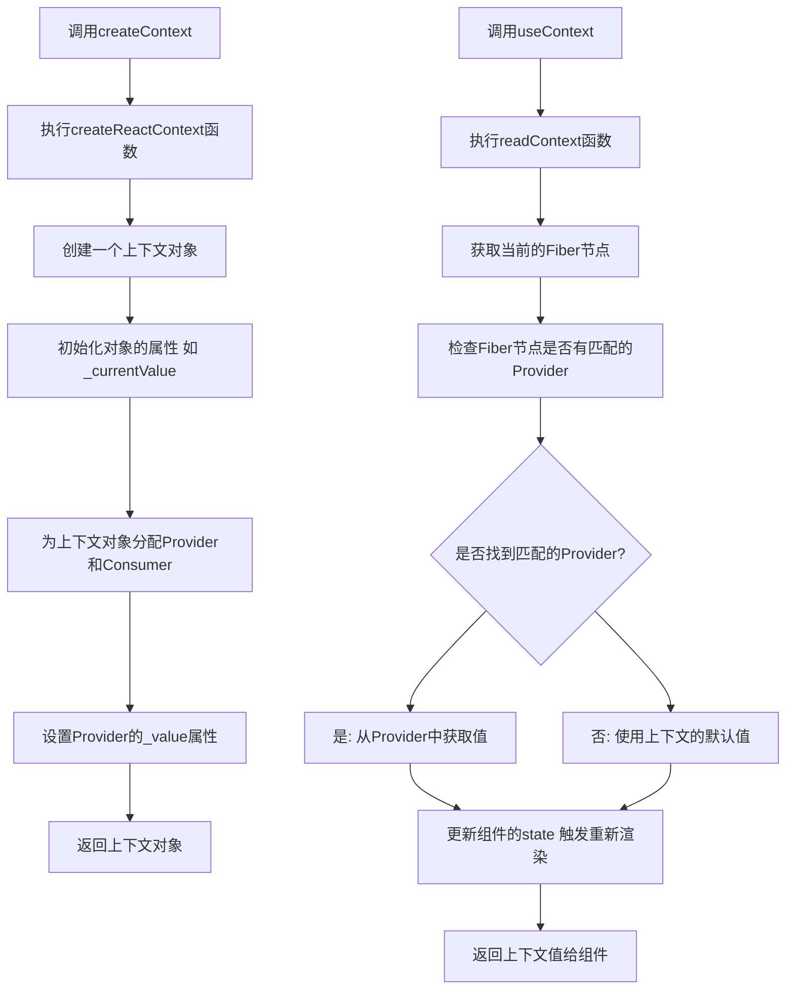

# React Hooks 系列 之 createContext、useContext

在 React 中，上下文（Context）API 提供了一个强大的方法，允许我们在组件树中轻松地传递数据，而不必手动将 props 传递到每一个层级。在本文中，我们将通过一个实际的示例来探讨如何使用 `createContext`、`useContext`。

## 逻辑示例：用户偏好设置

假设我们正在构建一个应用，用户可以选择应用的主题颜色和字体大小。我们希望这些设置在整个应用中都可用。

### 1. 创建上下文

首先，我们需要定义我们的上下文和默认值：

```javascript
const UserPreferencesContext = React.createContext({
  theme: "light",
  fontSize: "medium",
});
```

### 2. 使用 Provider

为了使我们的偏好设置在整个应用中都可用，我们需要在应用的顶层使用 `Provider`：

```javascript
function App() {
  const [preferences, setPreferences] = React.useState({
    theme: "light",
    fontSize: "medium",
  });

  return (
    <UserPreferencesContext.Provider value={{ preferences, setPreferences }}>
      <Navbar />
      <Content />
    </UserPreferencesContext.Provider>
  );
}
```

### 3. 使用 useContext

在函数组件中，我们可以使用 `useContext` Hook 来访问上下文：

```javascript
function Navbar() {
  const { preferences } = React.useContext(UserPreferencesContext);

  return (
    <nav
      style={{
        backgroundColor: preferences.theme === "dark" ? "#333" : "#FFF",
      }}
    >
      {/* ... */}
    </nav>
  );
}
```

### 4. 使用 Consumer

在类组件或需要更复杂的渲染逻辑的组件中，我们可以使用 `Consumer`：

```javascript
class Content extends React.Component {
  render() {
    return (
      <UserPreferencesContext.Consumer>
        {({ preferences, setPreferences }) => (
          <div>
            <p
              style={{
                fontSize: preferences.fontSize === "large" ? "20px" : "16px",
              }}
            >
              This is some content.
            </p>
            <button
              onClick={() =>
                setPreferences((prev) => ({ ...prev, theme: "dark" }))
              }
            >
              Switch to Dark Theme
            </button>
          </div>
        )}
      </UserPreferencesContext.Consumer>
    );
  }
}
```

## 完整示例：用户偏好设置

上述逻辑示例的具体实现：

<div ref="useContext1" />

::: details demo 代码
<<< @/components/react/hooks/useContext/UserSetting.jsx
:::

## 嵌套上下文

上下文可以嵌套，这意味着我们可以在应用的不同部分使用不同的上下文。当有多个嵌套的 Provider 时，最近的 Provider（即最内层的 Provider）的值会覆盖外部 Provider 的值。

<div ref="useContext2" />

::: details demo 代码
<<< @/components/react/hooks/useContext/NestedTheme.jsx
:::

## 调用 createContext、useContext 后大致执行情况



<script setup>
import { ref } from 'vue'
import renderReact from '@components/react/renderReact'
import UserSetting from '@components/react/hooks/useContext/UserSetting'
import NestedTheme from '@components/react/hooks/useContext/NestedTheme'

const useContext1 = ref(null)
const useContext2 = ref(null)
renderReact(UserSetting, useContext1)
renderReact(NestedTheme, useContext2)
</script>
