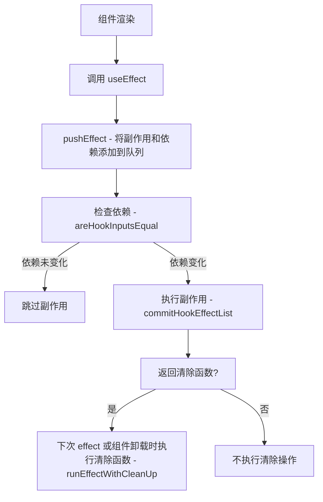

# React Hooks 系列 之 useEffect

`useEffect` 是 React Hooks 中的一个核心 Hook，它使你能够在函数组件中执行副作用操作。在类组件中，你可能习惯于在 `componentDidMount`、`componentDidUpdate` 和 `componentWillUnmount` 生命周期方法中执行副作用，而 `useEffect` 可以看作是这些生命周期方法的组合。

### 基本用法

`useEffect` 接受两个参数：一个函数和一个依赖数组。函数包含要执行的副作用代码，而依赖数组则决定了何时执行这些代码。

```javascript
useEffect(() => {
  console.log("Component did mount/update");
  return () => {
    console.log("Component will unmount");
  };
}, []);
```

### 无依赖

如果不提供依赖数组，`useEffect` 在每次渲染后都会执行：

```javascript
useEffect(() => {
  console.log("This runs after every render");
});
```

### 有依赖

当提供一个依赖数组时，只有当数组中的值发生变化时，`useEffect` 才会执行：

```javascript
const [count, setCount] = useState(0);

useEffect(() => {
  console.log("Count has changed:", count);
}, [count]);
```

### 有多个依赖

当提供一个依赖数组时，只有当数组中的值发生变化时，`useEffect` 才会执行：

```javascript
const [count, setCount] = useState(0);
const [value, setValue] = useState(0);

useEffect(() => {
  console.log("Count or Value has changed:", count, value);
}, [count, value]);
```

### 清除副作用

`useEffect` 可以返回一个函数，这个函数会在组件卸载或者依赖发生变化时执行，常用于清除副作用，如事件监听、定时器等：

```javascript
useEffect(() => {
  const timer = setTimeout(() => {
    console.log("This will run after 1 second");
  }, 1000);
  return () => {
    clearTimeout(timer);
  };
}, []);
```

### 使用多个 `useEffect`

你可以在一个组件中使用多个 `useEffect`，以将不同的副作用逻辑分开：

```javascript
useEffect(() => {
  console.log("This runs after every render");
});

useEffect(() => {
  console.log("This runs only once, similar to componentDidMount");
}, []);
```

### 注意事项

1. **不要在循环、条件或嵌套函数中调用 `useEffect`**，总是在组件的顶层调用它。

## useEffect 返回函数（cleanup function）执行时机

useEffect 的返回函数被称为“清除函数”（cleanup function）。这个函数的执行时机是在组件卸载之前或者在下一次 useEffect 运行之前。它的主要目的是进行清理工作，例如取消网络请求、清除定时器或取消订阅等。

以下是一些例子来说明清除函数的执行时机：

<div ref="useEffect4" />

::: details demo 代码
<<< @/components/react/hooks/useEffect/CleanupFunction.tsx
:::

### 1、组件卸载时执行清除函数

当组件被卸载（unmounted）时，`useEffect` 的清除函数会被调用，以确保不会产生任何副作用。

```js
useEffect(() => {
  console.log("Effect has been run.");

  return () => {
    console.log("Cleanup on component unmount.");
  };
}, []);

// 当组件首次挂载时，控制台会输出 "Effect has been run."
// 当组件被卸载时，控制台会输出 "Cleanup on component unmount."
```

### 2、依赖项变化时执行清除函数

如果 `useEffect` 的依赖项发生变化，清除函数会在下一次 `useEffect` 运行之前被调用。

```js
const [count, setCount] = useState(0);

useEffect(() => {
  console.log(`Effect for count: ${count}`);

  return () => {
    console.log(`Cleanup for count: ${count}`);
  };
}, [count]);

// 假设我们调用 setCount(1)：
// 控制台会首先输出 "Cleanup for count: 0"，然后输出 "Effect for count: 1"
```

在这个例子中，每当 `count` 的值发生变化时，都会首先执行清除函数，然后再执行 `useEffect` 的主体部分。

## 如何处理数组和对象作为依赖项

useEffect 的依赖项只会进行浅比较。这意味着它只比较依赖项数组中每个值的引用，而不是它们的深层内容。

### 1、依赖项内容未发生变化，但引用地址发生变化

<div ref="useEffect1" />

::: details demo 代码
<<< @/components/react/hooks/useEffect/ReferenceUnchanged.tsx
:::

这就是为什么当你将对象或数组作为 useEffect 的依赖项时，即使其内容没有变化，但只要引用发生了变化，useEffect 就会执行。

### 2、依赖项内容发生变化，但引用地址未发生变化

<div ref="useEffect2" />

::: details demo 代码
<<< @/components/react/hooks/useEffect/ReferenceChanged.tsx
:::

在这个案例中，userInfo 对象的引用没有发生变化。

userInfo 对象是在组件外部定义的，因此它的引用在组件的整个生命周期中都保持不变。即使你在 handleChangeUserInfo 函数中修改了 userInfo 对象的 age 属性，userInfo 对象的引用仍然是相同的。

因此，尽管 userInfo.age 的值在每次点击 "change userInfo" 按钮时都发生了变化，但由于 useEffect 的依赖项是 userInfo 对象的引用（而该引用没有变化），useEffect 内部的代码不会执行。

## 利用 useEffect 封装自定义 Hook-useDeepCompareEffect

依赖项是数组或者对象时，有如下解决办法：

- 1、使用 JSON.stringify() 将对象转换为字符串，然后将字符串作为依赖项。

- 2、使用 useDeepCompareEffect 自定义 Hook。利用 lodash 的 isEqual 方法，深比较对象或数组的内容是否发生变化。

<div ref="useEffect3" />

::: details demo 代码
::: code-group
<<< @/components/react/hooks/useEffect/DeepCompareEffect.tsx
<<< @/components/react/hooks/useEffect/useDeepCompareEffect.js
:::

## 调用 useEffect 后大致执行情况



<script setup>
import { ref } from 'vue'
import renderReact from '@components/react/renderReact'
import ReferenceUnchanged from '@components/react/hooks/useEffect/ReferenceUnchanged'
import ReferenceChanged from '@components/react/hooks/useEffect/ReferenceChanged'
import DeepCompareEffect from '@components/react/hooks/useEffect/DeepCompareEffect'
import CleanupFunction from '@components/react/hooks/useEffect/CleanupFunction'

const useEffect1 = ref(null)
const useEffect2 = ref(null)
const useEffect3 = ref(null)
const useEffect4 = ref(null)
renderReact(ReferenceUnchanged, useEffect1)
renderReact(ReferenceChanged, useEffect2)
renderReact(DeepCompareEffect, useEffect3)
renderReact(CleanupFunction, useEffect4)
</script>
