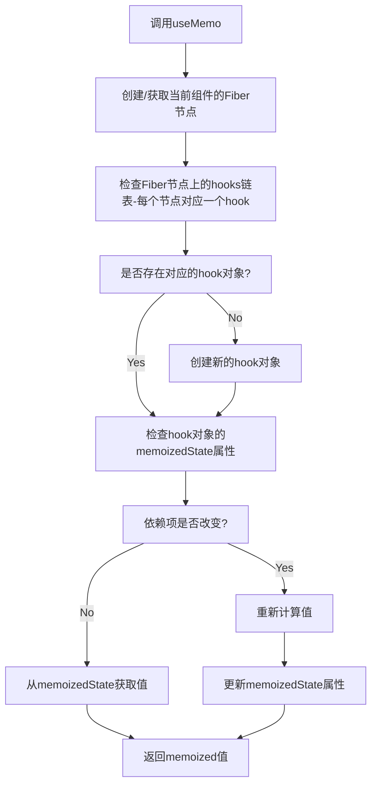

# React Hooks 系列 之 useMemo

## 介绍

useMemo 是 React 的一个 Hook，它用于优化性能，特别是在组件重新渲染时。当组件的某些状态或属性发生变化时，useMemo 可以帮助我们避免不必要的计算或渲染。

在复杂的 React 应用中，我们可能会遇到组件频繁重新渲染的情况，这可能会导致应用性能下降。有时，即使状态或属性发生了变化，我们也不希望执行某些计算或渲染。这时，useMemo 就派上了用场。

useMemo 接受两个参数：一个函数和一个依赖数组。函数返回我们想要“记住”的值，而依赖数组告诉 React 什么时候重新计算这个值。

```js
const memoizedValue = useMemo(() => computeExpensiveValue(a, b), [a, b]);
```

::: warning 注意
useMemo 第二个参数是一个数组，浅比较数组中的值，如果是对象或者数组即比较其引用是否发生了变化，如果有变化则重新计算，否则不重新计算。

案例可以参考 useEffect 中的依赖项。传送门：[React Hooks 系列 之 useEffect](/framework/react/hooks/use-effect.html)
:::

## 用法

### 1、跳过代价昂贵的重新计算

useMemo 返回一个 memoized 值。这意味着它会记住上一次的计算结果，并在依赖项没有发生变化时返回该结果，而不是重新计算。这可以帮助避免在每次渲染时进行昂贵的计算。

<div ref="useMemo1" />

::: details demo 代码
<<< @/components/react/hooks/useMemo/SkipExpensiveCalc.jsx
:::

在这个例子中，我们可以通过对比三个按钮的行为来分析`useMemo`的作用：

1. 对于"maxKey - 100"按钮：点击该按钮会更新`maxKey`的值，因为没有使用`useMemo`，所以只要有状态更新都会重新计算从 1 到`maxKey`的数字之和并显示在页面上计算数字之和，即使`maxKey`的值没有发生变化。

2. 对于"maxNumber - 100"按钮：点击该按钮会更新`maxNumber`的值，但是如果`maxNumber`没有发生变化，即点击前后的值相同，那么使用了`useMemo`的`maxNumberSum`函数不会重新计算，而是返回之前缓存的结果。只有`maxNumber`发生变化时，`maxNumberSum`才需要重新计算。

3. 对于"Count + 1"按钮：点击该按钮只会更新`count`的值，对`maxKey`和`maxNumber`没有影响。maxNumberSum 函数不会重新计算，因为它的依赖项没有发生变化。maxKeySum 由于没有使用 useMemo，所以页面重新渲染时，maxKeySum 函数会重新执行。

综上所述，`useMemo`的作用是在依赖项发生变化时进行记忆优化，避免不必要的重复计算，提高性能。在本例中，我们使用`useMemo`优化了从 1 到`maxNumber`的数字之和的计算，确保仅当`maxNumber`发生变化时才重新计算，避免了在每次渲染时都进行计算的开销。

### 2、跳过组件的重新渲染

`useMemo`的另一个用途是跳过组件的重新渲染。在某些情况下，我们希望组件的某些属性发生变化时，组件不会重新渲染。这时，我们可以使用`useMemo`来返回组件的 memoized 值，从而避免组件的重新渲染。

<div ref="useMemo2" />

::: details demo 代码
<<< @/components/react/hooks/memo/ObjectInProps3.jsx
:::

## 调用 useMemo 后大致执行情况



<script setup>
import { ref } from 'vue'
import renderReact from '@components/react/renderReact'
import SkipExpensiveCalc from '@components/react/hooks/useMemo/SkipExpensiveCalc'
import ObjectInProps3 from '@components/react/hooks/memo/ObjectInProps3'

const useMemo1 = ref(null)
const useMemo2 = ref(null)
renderReact(SkipExpensiveCalc, useMemo1)
renderReact(ObjectInProps3, useMemo2)
</script>
