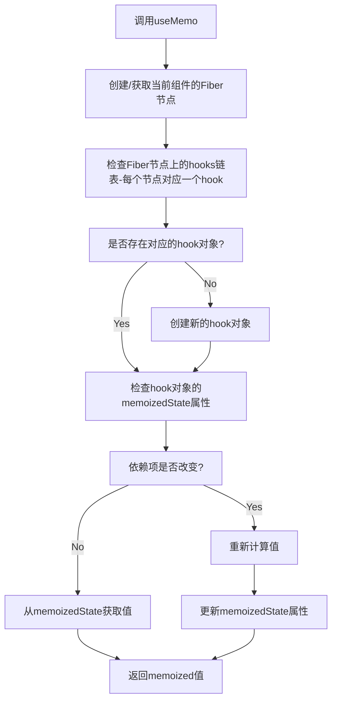

# React Hooks 系列 之 useMemo

## 调用 useMemo 后大致执行情况

```mermaid
graph TD
    A[调用useMemo]
    B[创建/获取当前组件的Fiber节点]
    C[检查Fiber节点上的hooks链表-每个节点对应一个hook]
    D[是否存在对应的hook对象?]
    E[创建新的hook对象]
    F[检查hook对象的memoizedState属性]
    G[依赖项是否改变?]
    H[从memoizedState获取值]
    I[重新计算值]
    J[更新memoizedState属性]
    K[返回memoized值]

    A --> B
    B --> C
    C --> D
    D -- No --> E
    D -- Yes --> F
    E --> F
    F --> G
    G -- No --> H --> K
    G -- Yes --> I --> J --> K
```
