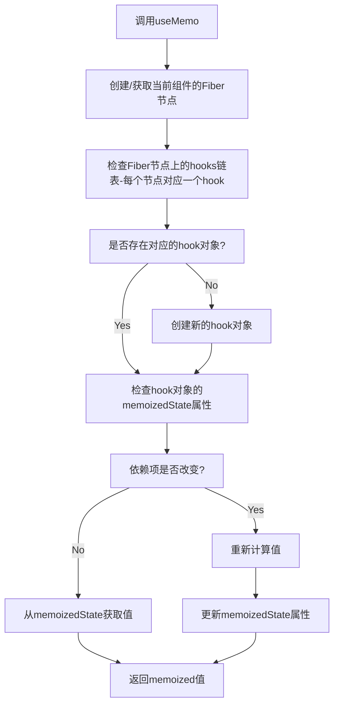

# React Hooks 系列 之 useMemo

## 介绍

useMemo 是 React 的一个 Hook，它用于优化性能，特别是在组件重新渲染时。当组件的某些状态或属性发生变化时，useMemo 可以帮助我们避免不必要的计算或渲染。

在复杂的 React 应用中，我们可能会遇到组件频繁重新渲染的情况，这可能会导致应用性能下降。有时，即使状态或属性发生了变化，我们也不希望执行某些计算或渲染。这时，useMemo 就派上了用场。

useMemo 接受两个参数：一个函数和一个依赖数组。函数返回我们想要“记住”的值，而依赖数组告诉 React 什么时候重新计算这个值。

```js
const memoizedValue = useMemo(() => computeExpensiveValue(a, b), [a, b]);
```

## 用法

### 1、跳过代价昂贵的重新计算

<div ref="useMemo1" />

::: details demo 代码
<<< @/components/react/hooks/useMemo/SkipExpensiveCalc.jsx
:::

## 调用 useMemo 后大致执行情况



<script setup>
import { ref } from 'vue'
import renderReact from '@components/react/renderReact'
import SkipExpensiveCalc from '@components/react/hooks/useMemo/SkipExpensiveCalc'

const useMemo1 = ref(null)
renderReact(SkipExpensiveCalc, useMemo1)
</script>
