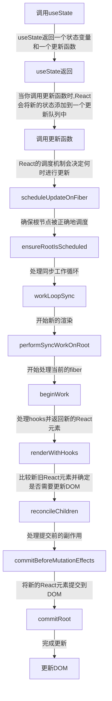

# React Hooks 系列 之 useState

在前端开发中，我们经常需要将后端传递的数据展示在页面上。这时，我们可能会想到使用多个变量来存储这些数据，然后在页面上的指定位置显示它们。但问题是，我们应该如何存储这些“状态”变量呢？

我们可以使用 var、const 或 let 来定义变量。然而，当变量的值发生变化时，我们希望页面能够重新渲染，但这些关键字定义的变量无法实现这一点。这时，React 的 useState 就派上了用场。

简而言之，useState 允许我们定义状态变量，并确保当这些状态变量的值发生变化时，页面会重新渲染。

## useState 返回值

```js
const [state, setState] = useState(initialState);
```

useState 返回一个长度为 2 的数组。通常，我们这样定义状态变量：

```js
const [key, setKey] = useState(0);
```

但实际上，我们也可以这样写：

```js
const keyArr = useState(0);
const key = keyArr[0];
const setKey = keyArr[1];
```

这种写法显得有些繁琐，但它有助于我们理解 useState 的返回值类型。

## useState 定义初始值

useState 定义初始值有两种用法：

- 传入一个初始值
- 传入一个函数

### 传入一个初始值

```js
const [key, setKey] = useState(0);
```

### 传入一个函数

```js
const [key, setKey] = useState(() => {
  return 0;
});
```

## useState 更新状态

更新状态有两种用法：

<div ref="useState1" />

::: details demo 代码
<<< @/components/react/hooks/useState/Basic.tsx
:::

这两种更新状态值的方式都是用于更新 `useState` 中的状态，但它们在某些情况下的行为是不同的。以下是它们之间的主要区别：

### 直接传递新的状态值:

在 `handleClick` 函数中，我们直接传递了一个新的状态值给 `setCount` 函数：

```javascript
function handleClick() {
  setCount(count + 1);
}
```

这种方法是基于当前渲染周期中的 `count` 值。如果 `setCount` 被连续调用多次，React 可能会批量处理这些更新，导致不预期的结果。

### 传递一个函数来更新状态:

在 `handleClickFn` 函数中，我们传递了一个函数给 `setCount`：

```javascript
function handleClickFn() {
  setCount((prevCount) => {
    return prevCount + 1;
  });
}
```

这种方法是基于先前的状态值。这个函数接收先前的状态值作为参数，并返回一个新的状态值。由于它总是基于最新的状态值，所以即使 `setCount` 被连续调用多次，也能得到预期的结果。

**举例说明**:

<div ref="useState2" />

::: details demo 代码
<<< @/components/react/hooks/useState/MultipleUpdates.tsx
:::

考虑以下代码：

```javascript
function handleMultipleUpdates() {
  setCount(count + 1);
  setCount(count + 1);
  setCount(count + 1);
}
```

如果 `count` 的初始值为 0，调用 `handleMultipleUpdates` 函数后，你可能期望 `count` 的值为 3。但实际上，由于三次 `setCount` 调用都基于同一个 `count` 值，结果 `count` 的值仍然为 1。

相反，如果我们使用函数式更新：

```javascript
function handleMultipleUpdatesFn() {
  setCount((prevCount) => prevCount + 1);
  setCount((prevCount) => prevCount + 1);
  setCount((prevCount) => prevCount + 1);
}
```

这时，每次 `setCount` 调用都基于最新的状态值，所以 `count` 的值会如预期地增加到 3。

**结论**:

- 当状态更新不依赖于先前的状态值时，可以直接传递一个新的状态值。
- 当状态更新依赖于先前的状态值，或者你需要连续多次更新状态时，建议使用函数式更新。

## useState 的惰性初始化

useState 的初始状态参数支持惰性初始化。这意味着你可以传递一个函数作为 useState 的参数，这个函数会在组件的首次渲染时被调用，而不是在每次渲染时都被调用。

惰性初始化的主要用途是为了优化性能。当初始化状态需要进行计算密集型操作或其他昂贵的操作时，你不希望这些操作在每次组件渲染时都被执行。通过使用惰性初始化，你可以确保这些操作只在组件首次渲染时执行一次。

假设你有一个大的 JSON 数据，你只想在组件首次渲染时解析它：

```jsx
const bigJsonData = "{...}"; // 大量的 JSON 数据

function MyComponent() {
  const [data, setData] = useState(() => {
    console.log("Parsing JSON");
    return JSON.parse(bigJsonData);
  });

  // ... 其他代码
}
```

在上述代码中，console.log("Parsing JSON") 只会在 MyComponent 首次渲染时打印一次，即使组件重新渲染多次。这是因为 useState 使用了惰性初始化，所以传递给它的函数只在首次渲染时被调用。

这种特性在处理大量数据或昂贵的计算时特别有用，因为它可以避免不必要的重复操作，从而提高应用的性能。

## useState 是异步函数吗

useState 不是异步函数。

在 React 中，当你调用 setState 或 useState 时，React 并不会立即更新组件。相反，它会将更新标记为“待处理”，并将其添加到一个更新队列中。然后，React 的调度机制会决定何时进行这些更新。

在 React 18 中，引入了新的并发模式，这使得 React 的调度机制变得更加复杂。在并发模式下，React 可以在多个更新之间进行切换，这意味着在某些情况下，useState 的行为可能看起来像是异步的。但实际上，这是由于 React 的调度机制，而不是 useState 本身是异步的。

例如，考虑以下代码：

```jsx
function MyComponent() {
  const [count, setCount] = useState(0);

  const handleClick = () => {
    setCount(count + 1);
    console.log(count);
  };

  return <button onClick={handleClick}>Click me</button>;
}
```

在这个例子中，当你点击按钮时，你可能期望控制台会打印出更新后的计数值。但实际上，它会打印出点击按钮时的计数值。这是因为 setCount 并不会立即更新 count 的值，而是将更新排入队列，等待 React 的调度机制决定何时进行更新。

因此，虽然 useState 可能在某些情况下表现得像是异步的，但这实际上是由于 React 的调度机制，而不是 useState 本身是异步的。

## 利用 useState 封装自定义 Hook-useSetState

```js
import { useCallback, useState } from "react";

/**
 * 一个自定义 hook，提供 setState 功能，但与 class 组件中的 setState 类似，
 * 它允许合并状态更新，而不是替换它。
 *
 * @param {Object} initialState - 初始状态，默认为空对象。
 * @returns {Array} 返回一个数组，第一个元素是当前状态，第二个元素是合并状态的函数。
 */
const useSetState = (initialState = {}) => {
  // 使用 useState hook 设置初始状态
  const [state, setState] = useState(initialState);

  // 定义一个合并状态的函数
  const setMergeState = useCallback((patch) => {
    setState((prevState) => ({
      ...prevState, // 保留之前的状态
      // 如果 patch 是一个函数，那么使用该函数返回的结果来更新状态，
      // 否则直接使用 patch 对象来更新状态。
      ...(typeof patch === "function" ? patch(prevState) : patch),
    }));
  }, []); // 使用空依赖数组，确保该回调函数不会重新创建

  // 返回当前状态和合并状态的函数
  return [state, setMergeState];
};

// 导出自定义 hook
export default useSetState;
```

这个自定义 Hook `useSetState` 的好处主要有以下几点：

1. **状态合并**：与类组件中的 `setState` 方法类似，`useSetState` 允许你合并状态，而不是完全替换它。这在处理复杂状态对象时特别有用，因为你可以只更新状态对象的某一部分，而不是每次都提供完整的新状态。

2. **简化状态更新**：在使用原生的 `useState` Hook 时，如果你想合并状态，你需要手动做这个合并。而 `useSetState` 提供了一个更简洁的方法来实现这一点，使得代码更加整洁和易读。

3. **函数式更新**：`useSetState` 支持传递一个函数作为参数，这个函数接受当前状态并返回要合并的新状态。这允许你基于当前状态来计算新的状态，这在处理依赖于当前状态的更新时非常有用。

4. **更接近类组件的体验**：对于那些习惯于类组件的开发者来说，`useSetState` 提供了一个更熟悉的 API 来处理状态，这可能会使从类组件迁移到函数组件的过渡更加顺畅。

总的来说，`useSetState` 提供了一个更加灵活和强大的方法来处理组件状态，特别是当你需要合并状态或基于当前状态来计算新的状态时。

## 调用 useState 后大致执行情况



<script setup>
import { ref } from 'vue'
import renderReact from '@components/react/renderReact'
import Basic from '@components/react/hooks/useState/Basic'
import MultipleUpdates from '@components/react/hooks/useState/MultipleUpdates'

const useState1 = ref(null)
const useState2 = ref(null)
renderReact(Basic, useState1)
renderReact(MultipleUpdates, useState2)
</script>
