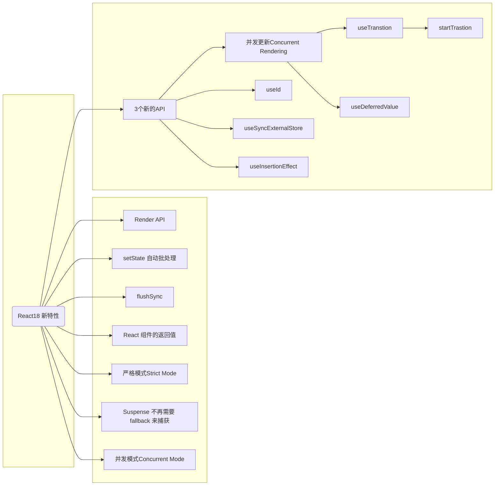

```mermaid
graph LR

    subgraph " "
        React18("React18 新特性")
    end
    
    subgraph " "
        RenderAPI[Render API]
        setState[setState 自动批处理]
        flushSync[flushSync]
        ReactReturn[React 组件的返回值]
        StrictMode[严格模式Strict Mode]
        Suspense[Suspense 不再需要 fallback 来捕获]
        ConcurrentMode[并发模式Concurrent Mode]
    end
    
    subgraph " "
        ThreeAPIs[3个新的API]
        ConcurrentRendering[并发更新Concurrent Rendering]

        useId[useId]
        useSync[useSyncExternalStore]
        useInsertion[useInsertionEffect]
        useTransition[useTranstion]
        startTransition[startTrastion]
        useDeferred[useDeferredValue]

        ThreeAPIs --> useId
        ThreeAPIs --> useSync
        ThreeAPIs --> useInsertion

        ConcurrentRendering --> useTransition
        useTransition --> startTransition
        ConcurrentRendering --> useDeferred
        
        ThreeAPIs --> ConcurrentRendering
    end

    React18 --> RenderAPI
    React18 --> setState
    React18 --> flushSync
    React18 --> ReactReturn
    React18 --> StrictMode
    React18 --> Suspense
    React18 --> ConcurrentMode
    React18 --> ThreeAPIs
```