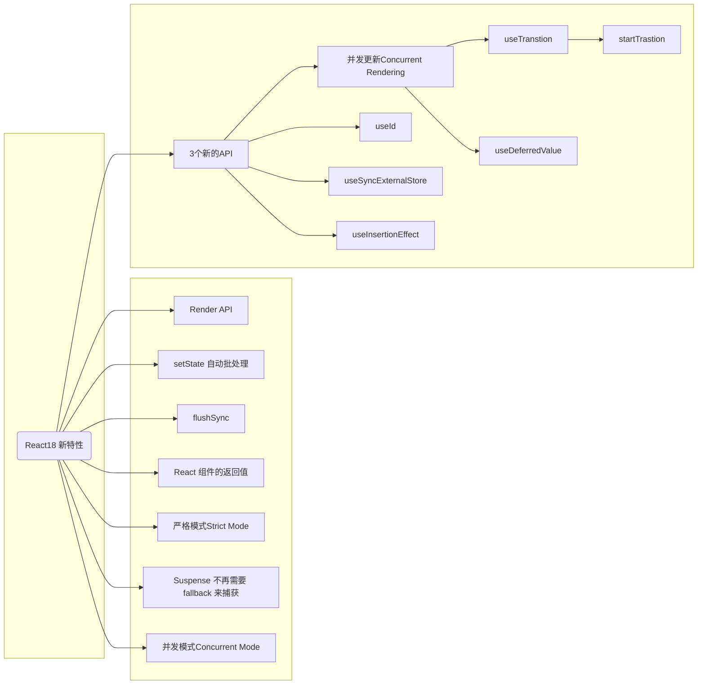

# React18 新特性

## 新特性

### Render API

React 18 引入了一个新的渲染 API，名为 `createRoot`。这是与 React 17 和之前版本中的 `ReactDOM.render` 方法相对的。

#### 1. createRoot

- 在 React 18 中，为了支持并发模式（Concurrent Mode），引入了新的 `createRoot` API。
- 使用这个 API，你可以创建一个 root，然后在这个 root 上调用 `render` 方法来渲染组件。
- 这种方式允许 React 在需要的时候中断渲染，从而实现更好的性能和用户体验。

示例：

```javascript
const root = ReactDOM.createRoot(document.getElementById("root"));
root.render(<App />);
```

#### 2. ReactDOM.render

- 在 React 17 和之前的版本中，我们使用 `ReactDOM.render` 方法来渲染组件。
- 这种方式是同步的，意味着一旦开始渲染，就会阻塞主线程直到渲染完成。

示例：

```javascript
ReactDOM.render(<App />, document.getElementById("root"));
```

React 18 的 `createRoot` API 是为了支持并发模式而引入的，它提供了一种新的、更灵活的方式来渲染组件，而 React 17 和之前的版本使用的是 `ReactDOM.render` 方法。

### setState 自动批处理

在 React 中，`setState` 的行为是一个经常被讨论的话题。特别是关于它的异步性和自动批处理。让我们来看看 React 17 和 React 18 在这方面的差异。

#### 1. React 17 及之前的版本

- 在 React 17 及其之前的版本中，React 会在事件处理器（如点击事件）中自动批处理 `setState` 调用。这意味着，如果你在一个事件处理器中连续调用多次 `setState`，React 会将这些更新批量处理，从而只触发一次重新渲染。
- 但是，在异步代码 `setTimeout`、`Promise` 中，`setState` 不会被批处理，每次调用都会导致组件重新渲染。

#### 2. React 18

- 在 React 18 中，由于引入了并发模式，`setState` 的批处理行为得到了增强。
- 不仅在事件处理器中，而且在大多数场景下，包括异步代码，React 都会尝试批处理多个 `setState` 调用，从而减少不必要的重新渲染。
- 这为开发者提供了更一致的行为和更好的性能。

React 18 在 `setState` 的自动批处理方面做了增强，使得在更多的场景下，连续的 `setState` 调用会被批量处理，从而减少不必要的渲染。

#### 例子

当然可以，以下是 React 18 中函数组件的例子，展示了 React 事件处理函数、`setTimeout` 异步函数以及原生 JS 事件中的 `setState`（在函数组件中是 `useState` 的 setter 函数）批处理行为：

##### React 事件处理函数

```javascript
import React, { useState } from "react";

function ReactEventHandlerExample() {
  const [count, setCount] = useState(0);

  const handleClick = () => {
    setCount((prevCount) => prevCount + 1);
    setCount((prevCount) => prevCount + 1);
    // 在React18和之前的版本中，这两次 setCount 调用都会被批处理，只触发一次重新渲染。
  };

  return <button onClick={handleClick}>Clicked {count} times</button>;
}
```

##### `setTimeout` 中的 `setState`

```javascript
import React, { useState } from "react";

function SetTimeoutExample() {
  const [count, setCount] = useState(0);

  const handleTimeout = () => {
    setTimeout(() => {
      setCount((prevCount) => prevCount + 1);
      setCount((prevCount) => prevCount + 1);
      // 在 React 17 和之前的版本中，这两次 setCount 调用不会被批处理，会触发两次重新渲染。
      // 在 React 18 中，这两次 setCount 调用也会被批处理，只触发一次重新渲染。
    }, 1000);
  };

  return <button onClick={handleTimeout}>Increase after 1 second</button>;
}
```

##### 原生 JS 事件

```javascript
import React, { useState, useEffect } from "react";

function NativeEventExample() {
  const [clicked, setClicked] = useState(false);
  const [count, setCount] = useState(0);

  useEffect(() => {
    const handleDocumentClick = () => {
      setClicked(true);
      setCount((prevCount) => prevCount + 1);
      // 在 React 17 和之前的版本中，这两次 setXXX 调用不会被批处理，会触发两次重新渲染。
      // 在 React 18 中，这两次 setXXX 调用也会被批处理，只触发一次重新渲染。
    };

    document.addEventListener("click", handleDocumentClick);

    // 清除事件监听器
    return () => {
      document.removeEventListener("click", handleDocumentClick);
    };
  }, []);

  return <div>Document was clicked {count} times</div>;
}
```

这些例子展示了在 React 18 中，无论是在 React 事件处理函数、`setTimeout` 异步函数还是原生 JS 事件中，连续的 `setState`（或 `setXXX`）调用都会被批处理，从而提高性能。

### flushSync

`flushSync` 是一个 ReactDOM 的 API，它允许你在 React 17 和 React 18 中同步地执行某些操作，确保这些操作在当前的 JavaScript 执行堆栈中完成。这对于那些需要立即获取 DOM 更新结果的场景特别有用。

在 React 17 中，由于 React 的更新是同步的（除非在某些异步场景中），所以大多数情况下你可能不需要 `flushSync`。但在 React 18 中，由于引入了并发模式，某些更新可能会被延迟执行，这时 `flushSync` 就变得非常有用。

以下是 `flushSync` 的使用示例：

### 1. 使用 `flushSync` 在函数组件中：

```javascript
import ReactDOM from "react-dom";

function App() {
  const [count, setCount] = useState(0);

  const handleImmediateUpdate = () => {
    ReactDOM.flushSync(() => {
      setCount((prevCount) => prevCount + 1);
    });
    ReactDOM.flushSync(() => {
      setCount((prevCount) => prevCount + 1);
    });
    // 在这里，count 的更新会立即被应用并重新渲染组件。不会批量更新。
  };

  return <button onClick={handleImmediateUpdate}>Increment</button>;
}
```

在上述示例中，当点击按钮时，`setCount` 更新会立即被应用，而不会被延迟。

但是在 `flushSync` 函数内部的多个 setState 仍然为批量更新。

```javascript
import ReactDOM from "react-dom";

function App() {
  const [count, setCount] = useState(0);

  const handleImmediateUpdate = () => {
    ReactDOM.flushSync(() => {
      // flushSync 内部仍然批量更新
      setCount((prevCount) => prevCount + 1);
      setCount((prevCount) => prevCount + 1);
    });
  };

  return <button onClick={handleImmediateUpdate}>Increment</button>;
}
```

总的来说，`flushSync` 是一个强大的工具，但应该谨慎使用，因为过度使用可能会导致性能问题。它主要用于那些确实需要同步执行的场景。

### React 组件的返回值

在 React 17 及之前的版本中，如果一个函数组件返回 `undefined`，React 会抛出一个错误。这是为了帮助开发者捕获可能的错误，因为在大多数情况下，组件不应该返回 `undefined`。

在 React 17 及之前的版本中，当函数组件返回 `undefined` 时，React 会抛出以下错误：

```
Nothing was returned from render. This usually means a return statement is missing. Or, to render nothing, return null.
```

但在 React 18 中，这一行为发生了变化。函数组件现在可以返回 `undefined` 而不会抛出错误。这意味着开发者可以更加灵活地定义组件，而不必担心意外返回 `undefined` 导致的错误。

总结：

- React 17 及之前：函数组件返回 `undefined` 会抛出错误。
- React 18：函数组件返回 `undefined` 是允许的，不会抛出错误。

### 严格模式 Strict Mode

`StrictMode` 是一个用于突出显示应用程序中潜在问题的工具。它不会渲染任何可见的 UI，但会在渲染生命周期中激活额外的检查和警告。

让我们看一下 React 17 和 React 18 中 `StrictMode` 的主要差异：

#### 1、React 17

**检测不安全的生命周期**：例如，`componentWillMount`、`componentWillReceiveProps` 和 `componentWillUpdate` 在严格模式下会触发警告，因为它们在未来的 React 版本中将被弃用。

**警告使用过时或废弃的 API**。

**检测意外的副作用**：在某些生命周期方法中，严格模式会故意两次调用它们，以帮助检测副作用。

**检测不推荐的 API 使用**，如 `findDOMNode`。

**检测遗留的 context API**。

#### 2、React 18

在 React 18 中，`StrictMode` 的行为基本上与 React 17 相同，但由于 React 18 引入了并发模式（Concurrent Mode），`StrictMode` 也开始检测与并发渲染相关的潜在问题。

**检测潜在的并发渲染问题**：由于 React 18 支持并发模式，`StrictMode` 会检查代码中是否存在可能与并发渲染不兼容的模式。

**双重调用效果**：为了检测副作用，React 18 在严格模式下可能会多次调用某些效果。

总的来说，React 18 的 `StrictMode` 在 React 17 的基础上增加了对并发模式的支持，并继续帮助开发者识别和修复潜在的问题。

### Suspense 不再需要 fallback 来捕获

当然可以。以下是 React 18 与 React 17 在处理`null`或`undefined`的`Suspense` fallbacks 时的差异总结：

#### React 17 及之前的版本

- 如果一个`Suspense`边界没有提供`fallback`（即`fallback`为`null`或`undefined`），React 会静默地跳过这个边界，并继续向上搜索下一个有`fallback`的`Suspense`边界。
- 例如：

```jsx
<Suspense fallback={<Loading />}> // <-- 这个边界被使用
  <Suspense> // <-- 这个边界被跳过，因为没有fallback
    <Page />
  </Suspense>
</Suspense>
```

在上述代码中，内部的`Suspense`边界没有提供`fallback`，所以 React 会跳过它并使用外部的`Suspense`边界的`fallback`。

#### React 18

- 在 React 18 中，即使一个`Suspense`边界的`fallback`为`null`或`undefined`，React 也会使用这个边界。在这种情况下，React 会为`fallback`渲染`null`，这意味着在数据加载期间不会显示任何内容。
- 例如：

```jsx
<Suspense fallback={<Loading />}> // <-- 这个边界不会被使用
  <Suspense> // <-- 这个边界被使用，为fallback渲染null
    <Page />
  </Suspense>
</Suspense>
```

在上述代码中，尽管内部的`Suspense`边界没有提供`fallback`，但 React 仍然会使用它。这意味着在`Page`组件的数据加载期间，不会显示任何内容（即`null`状态）。

这种变化确保了更加明确和一致的行为，特别是在开发和调试过程中。

## 3 个新的 API

### useId

`useId` 是 React 18 中的一个新的 Hook，它用于生成在服务器和客户端之间稳定的唯一 ID，同时避免 hydration 不匹配。

以下是 `useId` 的一些使用场景：

1. **基本使用**：直接将生成的 id 传递给需要它的元素。

   ```javascript
   function Checkbox() {
     const id = useId();
     return (
       <>
         <label htmlFor={id}>Do you like React?</label>
         <input id={id} type="checkbox" name="react" />
       </>
     );
   }
   ```

2. **在同一个组件中使用多个 ID**：使用相同的 id 附加一个后缀。
   ```javascript
   function NameFields() {
     const id = useId();
     return (
       <div>
         <label htmlFor={id + "-firstName"}>First Name</label>
         <div>
           <input id={id + "-firstName"} type="text" />
         </div>
         <label htmlFor={id + "-lastName"}>Last Name</label>
         <div>
           <input id={id + "-lastName"} type="text" />
         </div>
       </div>
     );
   }
   ```

需要注意的是：

- `useId` 不用于在列表中生成键。键应该从您的数据中生成。
- `useId` 生成的字符串包括 `:` 令牌。这有助于确保令牌是唯一的，但在 CSS 选择器或像 `querySelectorAll` 这样的 API 中不受支持。
- `useId` 支持一个 `identifierPrefix` 以防止在多根应用程序中发生冲突。要配置此选项，可以查看 `hydrateRoot` 和 `ReactDOMServer` 的选项。

### useSyncExternalStore

`useSyncExternalStore` 是 React 18 中引入的一个新的 Hook，它主要用于从外部数据源读取和订阅数据，同时与并发渲染功能（如选择性 hydration 和时间切片）兼容。

以下是 `useSyncExternalStore` 的一些使用场景：

1. **基本使用**：简单地订阅整个存储。

   ```javascript
   const state = useSyncExternalStore(store.subscribe, store.getSnapshot);
   ```

2. **订阅特定字段**：您还可以订阅特定的字段。

   ```javascript
   const selectedField = useSyncExternalStore(
     store.subscribe,
     () => store.getSnapshot().selectedField
   );
   ```

3. **服务器渲染时的使用**：在服务器渲染时，您必须序列化在服务器上使用的存储值，并将其提供给 `useSyncExternalStore`。React 将在 hydration 过程中使用此快照以防止服务器不匹配。
   ```javascript
   const selectedField = useSyncExternalStore(
     store.subscribe,
     () => store.getSnapshot().selectedField,
     () => INITIAL_SERVER_SNAPSHOT.selectedField
   );
   ```

需要注意的是：

- `getSnapshot` 必须返回一个缓存值。如果连续多次调用 `getSnapshot`，除非在此期间有存储更新，否则它必须返回完全相同的值。

### useInsertionEffect

useInsertionEffect 主要用途是在使用 useLayoutEffect 读取布局之前将样式注入到 DOM 中。

假设您正在使用一个 css-in-js 解决方案，并希望在组件渲染之前将某些样式注入到 DOM 中。您可以使用 `useInsertionEffect` 来确保样式在任何其他 DOM 读取或操作之前被注入。

```javascript
import { useInsertionEffect } from "react";

function MyComponent() {
  useInsertionEffect(() => {
    // 假设 `injectStyles` 是一个函数，它将样式注入到 DOM 中
    injectStyles(`
      .my-class {
        color: red;
      }
    `);
  });

  return <div className="my-class">This text should be red.</div>;
}

function injectStyles(css) {
  const style = document.createElement("style");
  style.type = "text/css";
  style.appendChild(document.createTextNode(css));
  document.head.appendChild(style);
}
```

在上面的示例中，`useInsertionEffect` 用于在组件渲染之前将 `.my-class` 的样式注入到 DOM 中。这确保了当组件的 DOM 被渲染时，相关的样式已经存在，从而避免了任何潜在的样式闪烁或不一致。

## 并发模式 Concurrent Mode

并发模式（Concurrent Mode）是 React 的一个新特性，它使 React 的渲染过程可以被中断和重新开始，从而优化应用的响应性和交互体验。

### 为什么需要并发模式

在 React 17 之前，React 的渲染过程是同步的，即一旦开始渲染，就会一直执行到结束。这意味着，如果渲染过程中有一些耗时的任务，比如渲染大量的 DOM 节点，那么在渲染过程中，页面上的其他交互就会被阻塞，直到渲染完成。

这种同步渲染的方式，对于大多数应用来说，是没有问题的。但是，对于一些复杂的应用，比如有大量 DOM 节点的应用，或者有复杂计算的应用，同步渲染就会导致页面上的其他交互被阻塞，从而影响用户体验。

为了解决这个问题，React 18 引入了并发模式，使得 React 的渲染过程可以被中断和重新开始，从而优化应用的响应性和交互体验。

### 并发特性

React 18 中的并发模式，主要包含以下几个特性：

#### useTransition

`useTransition` 是 React 的一个 Hook，它允许组件避免不希望的加载状态，通过等待内容加载完成后再进行页面切换。它还允许组件将较慢的、需要数据获取的更新推迟到后续的渲染，从而可以立即渲染更关键的更新。

示例：

```javascript
function App() {
  const [resource, setResource] = useState(initialResource);
  const [isPending, startTransition] = useTransition();
  return (
    <>
      <button
        disabled={isPending}
        onClick={() => {
          startTransition(() => {
            const nextUserId = getNextId(resource.userId);
            setResource(fetchProfileData(nextUserId));
          });
        }}
      >
        Next
      </button>
      {isPending ? " Loading..." : null}
      <Suspense fallback={<Spinner />}>
        <ProfilePage resource={resource} />
      </Suspense>
    </>
  );
}
```

在这段代码中，我们使用 `startTransition` 包裹了数据获取操作。这允许我们立即开始获取 profile 数据，同时推迟渲染下一个 profile 页面及其关联的 Spinner。`isPending` 布尔值让 React 知道我们的组件正在进行转换，因此我们可以通过在前一个 profile 页面上显示一些加载文本来通知用户。

简而言之，`useTransition` 提供了一种机制，使得在数据加载时，UI 可以保持响应并避免不必要的加载状态，从而提供更流畅的用户体验。

#### useDeferredValue

`useDeferredValue` 是 React 的一个 Hook，它返回一个可能“滞后于”其原始值的延迟版本。

**使用场景**：
当你有基于用户输入立即渲染的内容，以及需要等待数据获取的内容时，这个 Hook 通常很有用。它的主要目的是保持界面的响应性。

**示例**：

```javascript
function App() {
  const [text, setText] = useState("hello");
  const deferredText = useDeferredValue(text);

  return (
    <div className="App">
      {/* 保持将当前文本传递给输入 */}
      <input value={text} onChange={handleChange} />
      ...
      {/* 但当有必要时，列表可以“滞后” */}
      <MySlowList text={deferredText} />
    </div>
  );
}
```

在此示例中，我们可以立即开始为输入显示新文本，使网页感觉响应迅速。与此同时，`MySlowList` “滞后”，允许它在后台使用当前文本进行渲染。

简而言之，`useDeferredValue` 允许某些 UI 部分立即响应用户输入，同时其他可能需要更多时间来更新的部分可以稍后渲染，从而提供更流畅的用户体验。

## React18 新特性流程图


